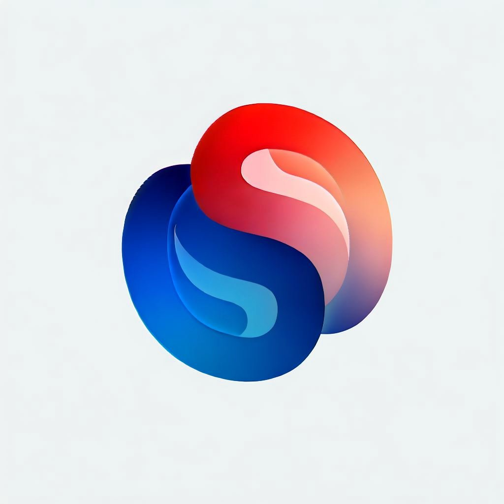
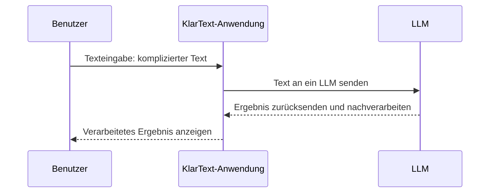

# KlarText - Schwer lesbare Texte besser zugänglich machen

## Projektübersicht

**KlarText** ist ein Projekt, das sich der Aufgabe verschrieben hat, komplexe Texte mithilfe von künstlicher Intelligenz in Einfache Sprache umzuwandeln. Die Hauptmotivation hinter diesem Projekt besteht darin, die Zugänglichkeit von Informationen für Menschen mit begrenzter Lesekompetenz, funktionale Analphabeten und Nicht-Muttersprachler signifikant zu verbessern. Im Kern geht es darum, gesellschaftliche Barrieren abzubauen und die Teilhabe in der Gesellschaft zu fördern.

## Warum Einfache Sprache?

[Einfache Sprache](https://de.wikipedia.org/wiki/Einfache_Sprache) (nicht zu verwechseln mit [Leichter Sprache](https://de.wikipedia.org/wiki/Leichte_Sprache), ist ein mächtiges Instrument, um Informationen für eine breitere Bevölkerungsschicht verständlich und zugänglich zu machen. Es gibt zwar keine festen Regeln für Einfache Sprache, aber bewährte Prinzipien:

- **Klare und logische Satzstruktur**: Sätze sollten einfach und verständlich aufgebaut sein.

- **Vermeidung von Gedankensprüngen**: Um Verwirrung zu verhindern, sollten Gedankensprünge vermieden werden.

- **Begrenzte Satzlänge**: Ideal ist eine Satzlänge von etwa zehn bis elf Wörtern, bei Nebensätzen etwa fünfzehn Wörter.

- **Ein Gedanke pro Satz**: Jeder Satz sollte nur einen Gedanken vermitteln.

- **Aktive Schreibweise**: Verben sollten in der aktiven Form verwendet werden.

- **Verwendung bekannter und klarer Wörter**: Unbekannte oder mehrdeutige Wörter sollten vermieden werden.

- **Verzicht auf Metaphern und Ironie**: Diese können leicht missverstanden werden.

- **Konkrete Ausdrücke statt Abstraktionen**: Abstrakte Begriffe sollten durch konkrete Ausdrücke ersetzt werden.

- **Ausgeschriebene Abkürzungen**: Abkürzungen sollten stets ausgeschrieben werden.

Diese Grundsätze der Einfachen Sprache richten sich an ein breites Publikum, einschließlich Deutschlernender und Menschen mit begrenzter Lesekompetenz.

## Gesellschaftliche Herausforderung

In Deutschland haben viele Menschen Schwierigkeiten beim Lesen und Verstehen komplexer Texte. Diese Herausforderung betrifft ein breites Spektrum von Menschen, darunter funktionale Analphabeten, Personen mit Lese- und Rechtschreibschwäche und Deutschlernende. KlarText zielt darauf ab, diese gesellschaftliche Herausforderung anzugehen, da sie die Teilhabe dieser Gruppen am gesellschaftlichen Leben stark einschränkt. Die wichtigsten Aspekte des Problems sind:

1. **Mangelnde Lesekompetenz und Lesebarriere**: Millionen von Menschen in Deutschland haben Schwierigkeiten beim Lesen und Verstehen komplexer Texte. Dies betrifft nicht nur Bildungsmaterialien, sondern auch wichtige Informationen im Alltag, wie Gesundheitsratschläge, rechtliche Dokumente und offizielle Mitteilungen. KlarText bietet eine Lösung, um diese Lesebarriere zu überwinden und den Zugang zu kritischen Informationen zu ermöglichen.

2. **Eingeschränkte demokratische Teilhabe**: Menschen mit begrenzter Lesekompetenz finden es oft schwer, an demokratischen Prozessen teilzunehmen und informierte Entscheidungen zu treffen. Dies kann ihre Fähigkeit, an Wahlen teilzunehmen, politische Diskussionen zu verfolgen und am öffentlichen Leben teilzunehmen, stark beeinträchtigen.

3. **Bildungsungleichheit**: Personen mit Lese- und Schreibschwierigkeiten haben oft Schwierigkeiten im Bildungsbereich, da viele Bildungsinhalte in komplexer Sprache verfasst sind. Dies führt zu Bildungsungleichheit und beschränktem Zugang zu lebenswichtigen Informationen.

4. **Barriere für Informationszugang**: Komplexe Sprache in offiziellen Dokumenten, Bildungsmaterialien, Gesundheitsinformationen und anderen Texten stellt eine erhebliche Barriere für den Zugang zu wichtigen Informationen dar. Dies kann schwerwiegende Auswirkungen auf die Gesundheit, das Arbeitsleben und die soziale Integration haben.

5. **Kosten**: Die Erstellung von Texten in Einfache Sprache erfordert normalerweise erhebliche redaktionelle Arbeit und ist daher teuer. Dies führt dazu, dass viele Organisationen und Institutionen auf Einfache Sprache verzichten, da sie sich dies nicht leisten können.

Die geschilderte Situation führt zu sozialer Ungerechtigkeit, Bildungsungleichheit und eingeschränkter gesellschaftlicher Teilhabe für viele Menschen. KlarText setzt sich das Ziel, diese Probleme anzugehen, indem es eine benutzerfreundliche und kostenfreie (Open-Source) Lösung für die Erstellung von Texten in Einfacher Sprache bereitstellt. 

## Zielgruppe

Die Zielgruppe von KlarText umfasst Menschen mit eingeschränkter Lesekompetenz, Deutschlernende und Personen, die Schwierigkeiten beim Verstehen komplexer Texte haben. 

Auch Autoren, Bildungseinrichtungen, Non-Profit-Organisationen, soziale Dienste sowie Regierungsbehörden und öffentliche Institutionen profitieren von dieser Lösung.

## Technische Umsetzung

Die technische Umsetzung von KlarText umfasst eine Reihe von Schlüsselkonzepten:

- **Standalone-App**: KlarText wird als eigenständige Anwendung entwickelt, die auf dem Electron-Framework basiert. Dadurch ist sie plattformübergreifend nutzbar und einfach zu installieren.

- **Programmiersprache**: Die Implementierung erfolgt in Node.js / TypeScript, um eine leistungsfähige und moderne Basis zu gewährleisten.

- **Barrierearme Bedienung**: Die Benutzeroberfläche wird barrierearm gestaltet, um Menschen mit unterschiedlichen Einschränkungen einen leichteren Zugang zu ermöglichen.

- **Konfigurierbarkeit**: Autoren können über die Benutzeroberfläche Parameter und Einstellungen anpassen, um die generierte Ausgabe an individuelle Bedürfnisse anzupassen.

- **Künstliche Intelligenz**: KlarText setzt auf Large Language Models (LLMs), um bestehende Texte in Einfache Sprache umzuwandeln.

- **Nachverarbeitung**: Die Ergebnisse eine LLM werden nicht blind übernommen, sondern konventionell nachbearbeitet.

- **Wechseloption zwischen KIs**: Die Lösung erlaubt Benutzern, zwischen verschiedenen KI-Modellen umzuschalten. Dies stellt sicher, dass KlarText auch zukünftig mit neuen, leistungsfähigeren Modellen arbeiten kann.

- **Offline-Betrieb**: Wenn der Benutzer über ein lokales LLM verfügt (z.B. durch das [GPT4ALL-Projekt](https://gpt4all.io/index.html)), kann KlarText komplett offline betrieben werden. Dies gewährleistet Datenschutz und Unabhängigkeit von externen Diensten.

- **Transparente Nutzung von Prompts**: Bei der Verwendung verschiedener LLMs werden Prompts verwendet, um den Umwandlungsprozess zu steuern. Diese Prompts sind transparent für den Benutzer und können angepasst werden.

## Ablauf einer Sitzung in KlarText

Die KlarText-Anwendung bietet eine benutzerfreundliche Möglichkeit, komplexe Texte in Einfache Sprache umzuwandeln. 

Im folgenden Diagram wird der Ablauf detailliert beschrieben:

1. **Texteingabe durch den Benutzer**: Der Prozess beginnt, wenn ein Benutzer Text in die KlarText-Anwendung eingibt. Dieser Text kann aus komplexen oder schwer verständlichen Inhalten bestehen, die in eine leicht verständliche Form umgewandelt werden sollen.

2. **Übertragung an den Anwendungskern**: Nachdem der Benutzer den Text eingegeben hat, überträgt die KlarText-Anwendung den Text an den Kern der Anwendung. 

3. **Textverarbeitung durch Künstliche Intelligenz**: Mit einem vom Benutzer gewählten LLM, das grundsätzlich online oder offline (siehe zum Beispiel [GPT4ALL](https://gpt4all.io/index.html) betrieben werden kann, startet die Anwendung nun die Verarbeitung des eingegebenen Textes. Die KI analysiert den Text, erkennt komplexe Strukturen, schwierige Wörter und unverständliche Passagen. Sie wandelt den Text in eine einfachere und leicht verständliche Form um, unter Berücksichtigung der Grundsätze der Einfachen Sprache, wie klare Satzstruktur, kurze Sätze und allgemein verständliche Wörter.

4. **Nachverarbeitung**: Nachdem per LLM der Text erfolgreich umgewandelt wurde, wird das Ergebnis konventionell nachverarbeitet. Regeln für einfache Sprache, die einfach mit Hilfe von String-Verarbeitung umgesetzt werden können, müssen nicht per LLM umgesetzt werden. 

5. **Übertragung des verarbeiteten Ergebnisses**: Das Ergebnis wird an die KlarText-Anwendung geschickt. Dieses Ergebnis ist nun in Einfacher Sprache verfasst und leichter verständlich.

6. **Anzeige des Ergebnisses für den Benutzer**: Schließlich zeigt KlarText das verarbeitete Ergebnis dem Benutzer an. Dies ermöglicht es dem Benutzer, den nun leicht verständlichen Text zu lesen, zu verstehen oder weiter zu verwenden.

## Aktueller Stand und Geplante Neuerungen

KlarText befindet sich derzeit in der Konzeptionsphase. Es wurden als Proof-Of-Concept bereits erfolgreiche Tests im interaktiven Modus mit verschiedenen LLM-Systemen durchgeführt. Der nächste Schritt ist die Entwicklung einer benutzerfreundlichen Oberfläche, die auch Nicht-Technikern die Nutzung dieser leistungsstarken Möglichkeit ermöglicht. Die Möglichkeit zur Auswahl und Einbindung verschiedener LLMs wird angestrebt, um die Lösung zukunftssicher zu gestalten und kontinuierlich zu erweitern.

## Unterschiede zu bestehenden Anwendungen und Lösungen

Obwohl es bereits einige kommerzielle Anbieter von Lösungen zur Erstellung von Texten in Einfacher Sprache gibt, hebt sich KlarText in mehreren Punkten von diesen Ansätzen ab:

- **Freie Software**: KlarText wird unter einer Open-Source-Lizenz veröffentlicht, was es für Endnutzer und die Entwicklergemeinschaft kostenlos, zugänglich und anpassbar macht.

- **Sicherheit und Kontrolle**: Benutzer entscheiden, welchem LLM-Anbieter sie ihre Daten anvertrauen möchten. Der Offline-Betrieb bietet zusätzliche Sicherheit und Datenschutz.

- **Benutzeranpassung & Erweiterbarkeit**: KlarText kann in der Zukunft um zusätzliche LLMs erweitert werden, um Leistung oder Genauigkeit zu verbessern. Die zum Einsatz kommenden Prompts sind transparent und anpassbar.

Insgesamt strebt KlarText danach, eine leistungsfähige und flexible Lösung bereitzustellen, die nicht nur benutzerfreundlich ist, sondern auch viele Autoren und Organisationen bei der Erstellung von Texten in Einfacher Sprache unterstützt.

## Vision

KlarText hat das Ziel, den Zugang zu Informationen und Bildung für alle zu erleichtern und damit einen positiven Beitrag zur Gesellschaft zu leisten. Mit einer starken Open-Source-Community und einer klaren Mission, wird KlarText dazu beitragen, Barrieren zu durchbrechen und die Teilhabe in der Gesellschaft zu fördern.

**Wir machen komplexe Texte verständlich und verbessern die Lebensqualität von Millionen von Menschen.**

